# AmISafe Mobile Application Process Flow Documentation

## 🚀 Application Lifecycle Process Flows

### **1. Application Startup Flow**

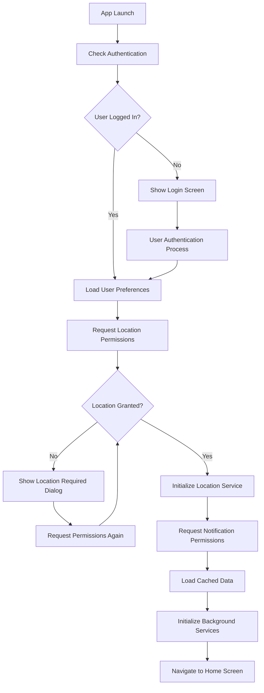

### **2. User Registration & Authentication Flow**

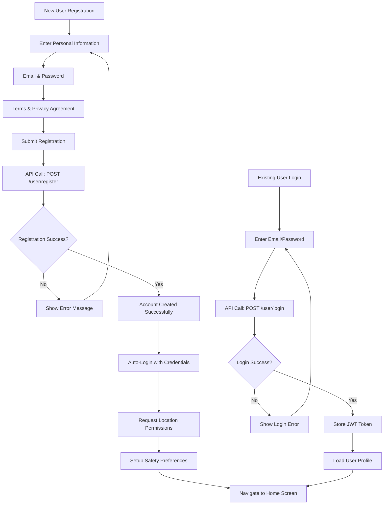

### **3. Location Tracking & H3 Processing Flow**

```mermaid
graph TD
    A[GPS Location Update] --> B[Extract Lat/Lng Coordinates]
    B --> C[Calculate H3 Index Level 13]
    C --> D{H3 Index Changed?}
    D -->|No| E[Continue Monitoring]
    E --> A
    D -->|Yes| F[Store Previous H3 Index]
    F --> G[Update Current Location State]
    G --> H[Check Cached Risk Data]
    H --> I{Cache Valid & Recent?}
    I -->|Yes| J[Use Cached Risk Level]
    I →|No| K[API Call: GET /api/amisafe/risk-level]
    K --> L[Process Risk Response]
    J --> M[Update UI with Risk Level]
    L --> M
    M --> N[Compare with Previous Risk]
    N --> O{Risk Level Increased?}
    O -->|Yes| P[Trigger Risk Notification]
    O -->|No| Q[Update Background State]
    P --> Q
    Q --> E
```

### **4. Risk Assessment & Notification Flow**

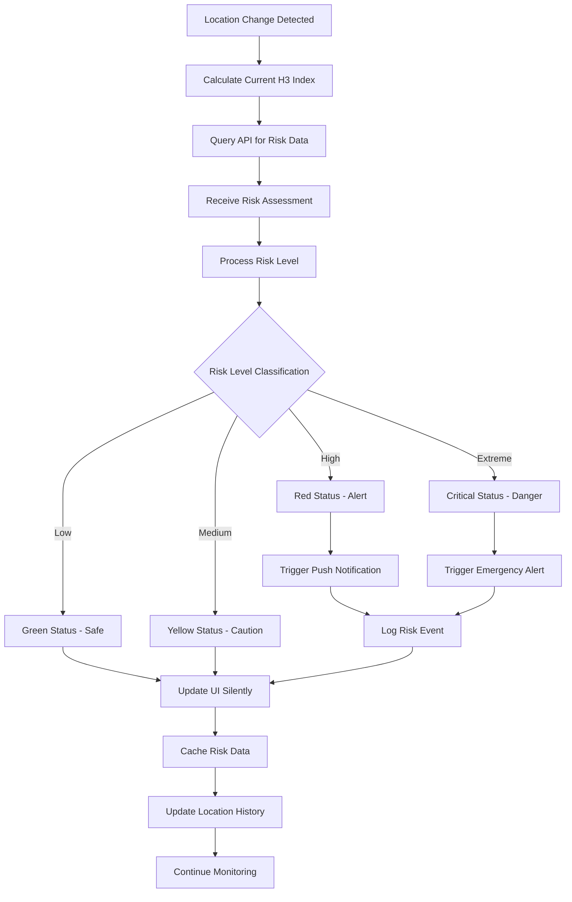

### **5. Background Monitoring Process Flow**

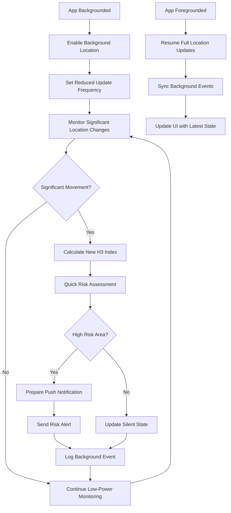

## 📊 Data Flow Process Diagrams

### **6. API Request/Response Flow**

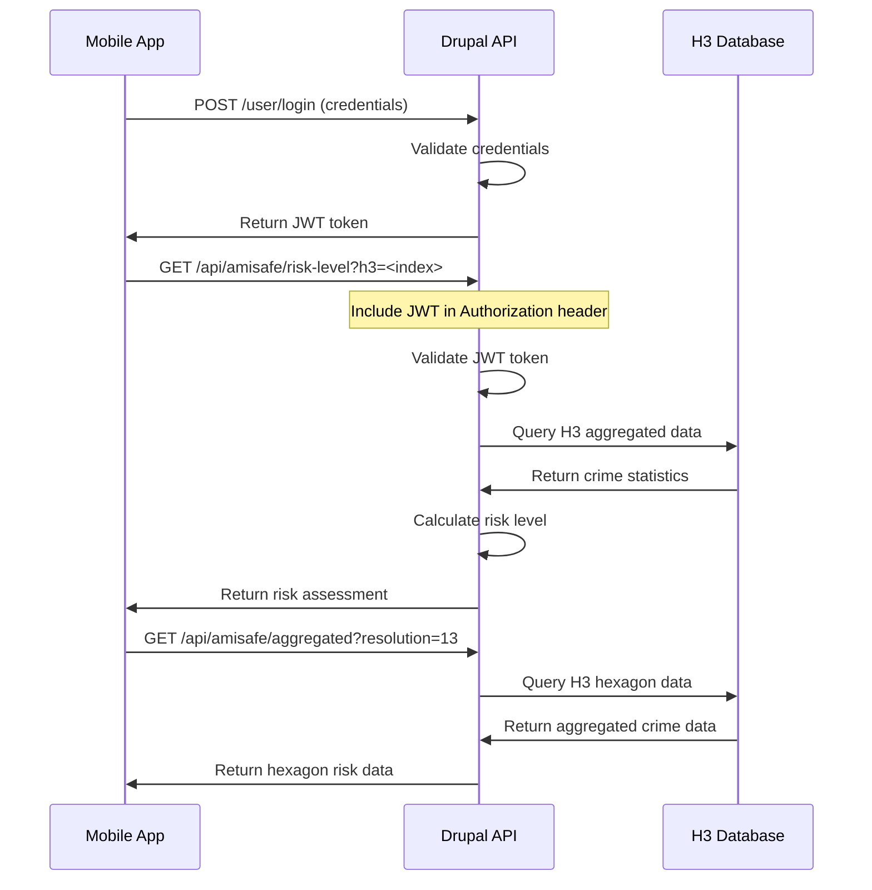

### **7. Offline Data Synchronization Flow**

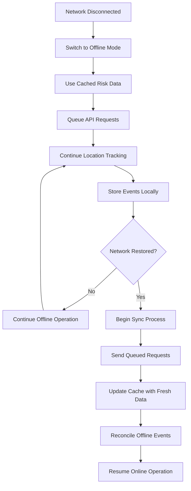

## 🔔 Notification Process Flows

### **8. Push Notification Trigger Flow**

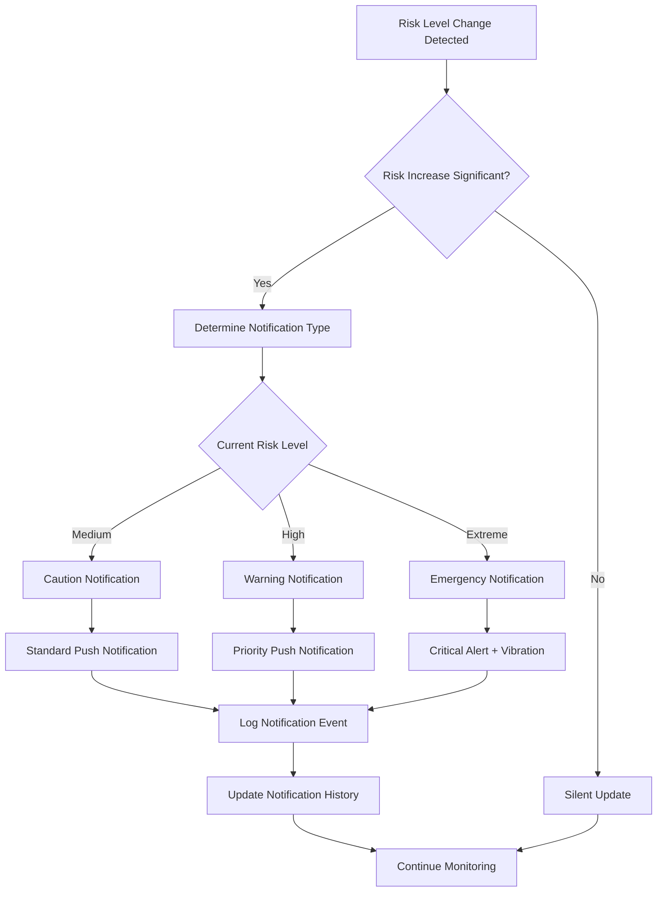

### **9. Emergency Response Flow**

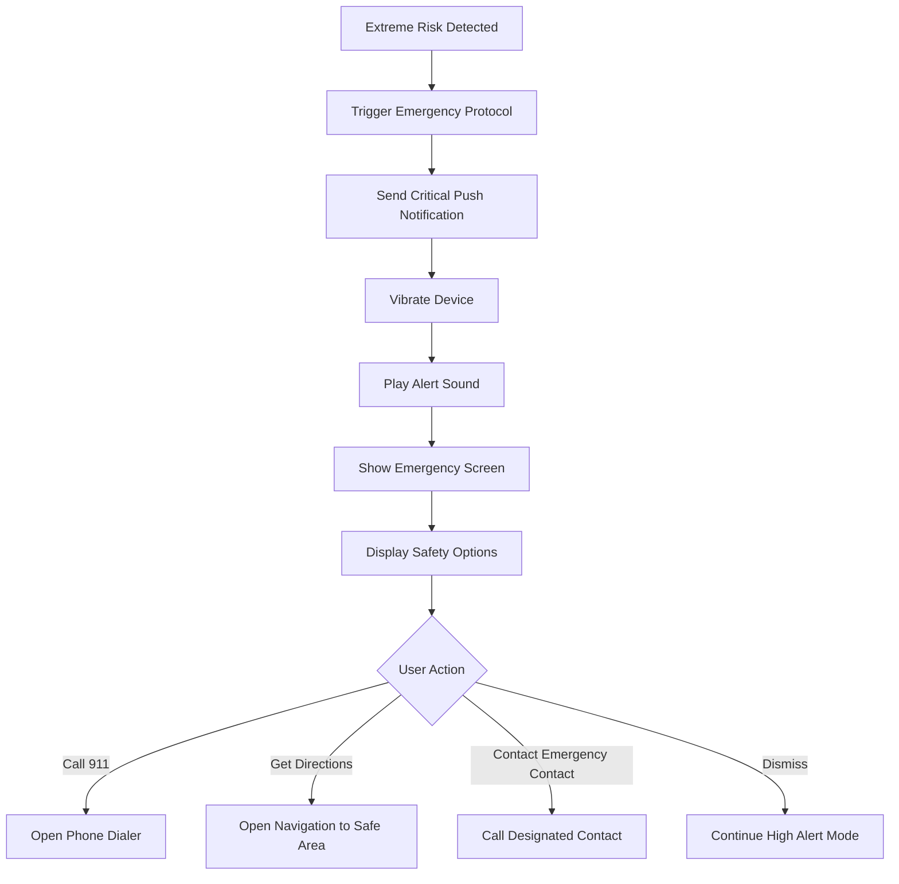

## 📱 User Interface Process Flows

### **10. Home Screen Interaction Flow**

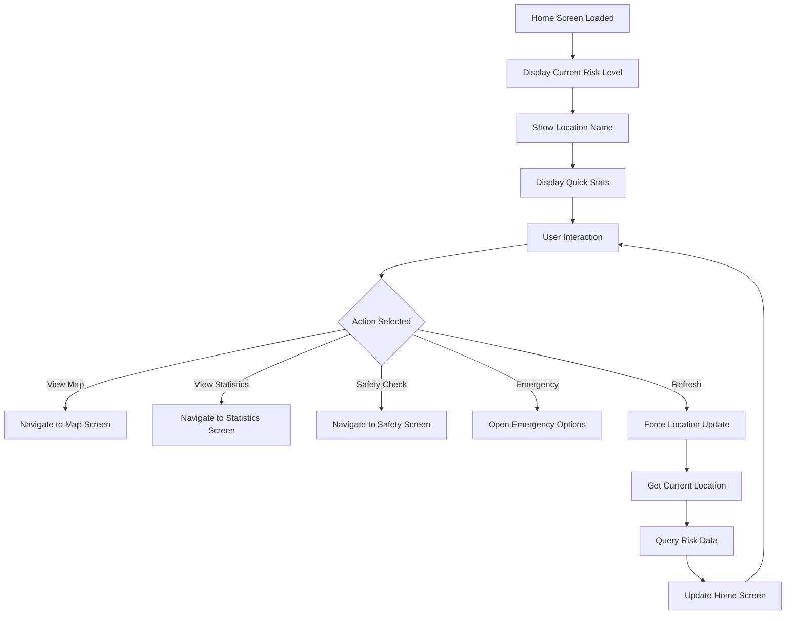

### **11. Map Screen Interaction Flow**

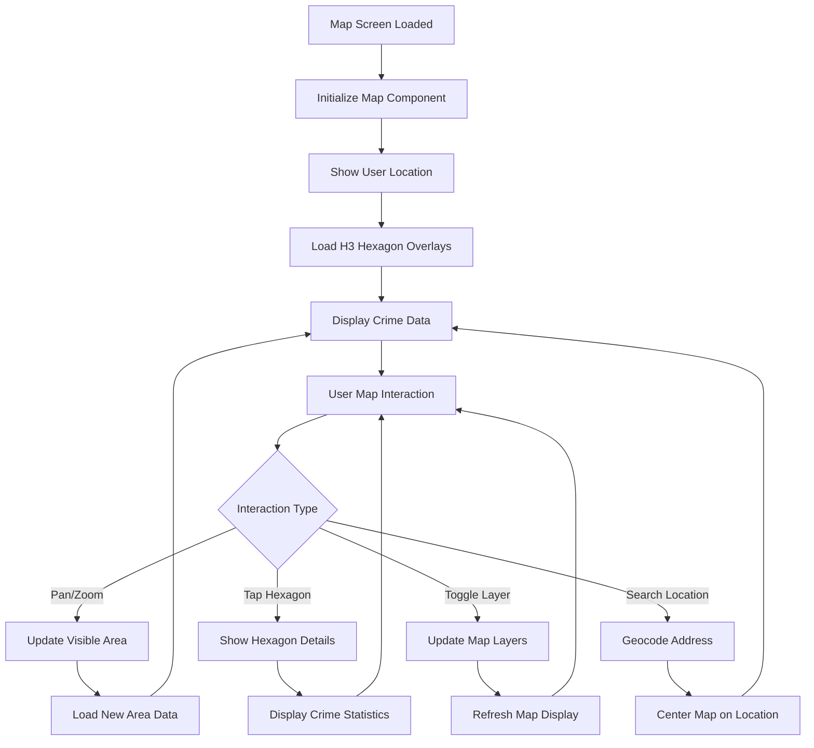

## 🔄 Data Synchronization Process Flows

### **12. Cache Management Flow**

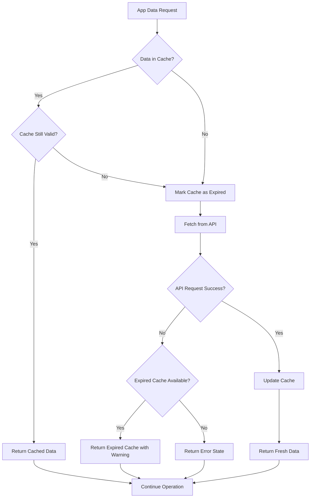

### **13. User Preference Sync Flow**

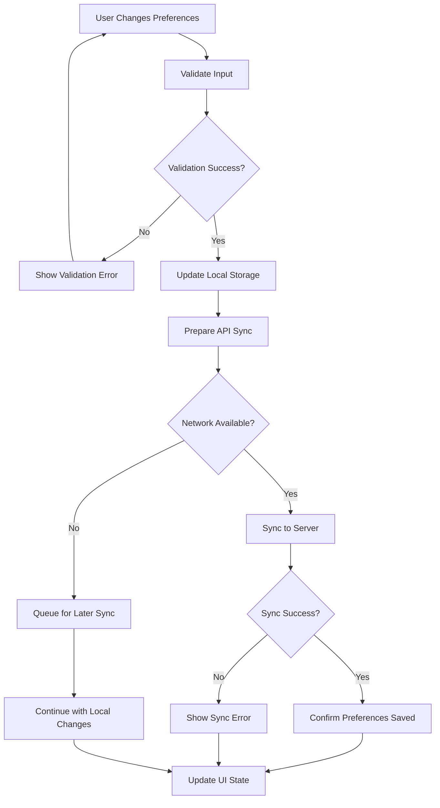

## 🛡️ Security Process Flows

### **14. JWT Token Management Flow**

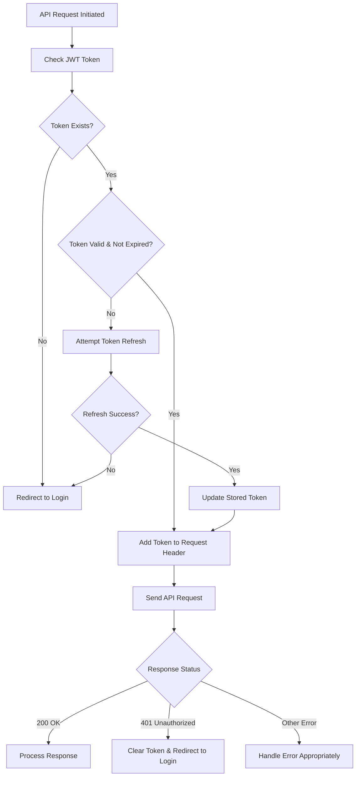

### **15. Privacy & Data Protection Flow**

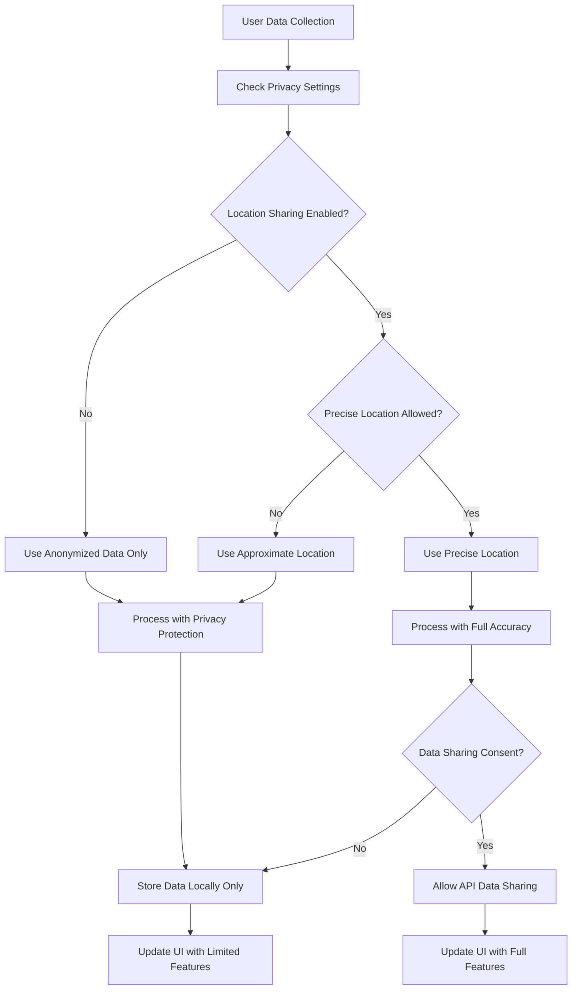

This comprehensive process flow documentation covers all major user interactions, data flows, and system processes within the AmISafe mobile application, ensuring clear understanding of how the application operates from user registration through ongoing safety monitoring.