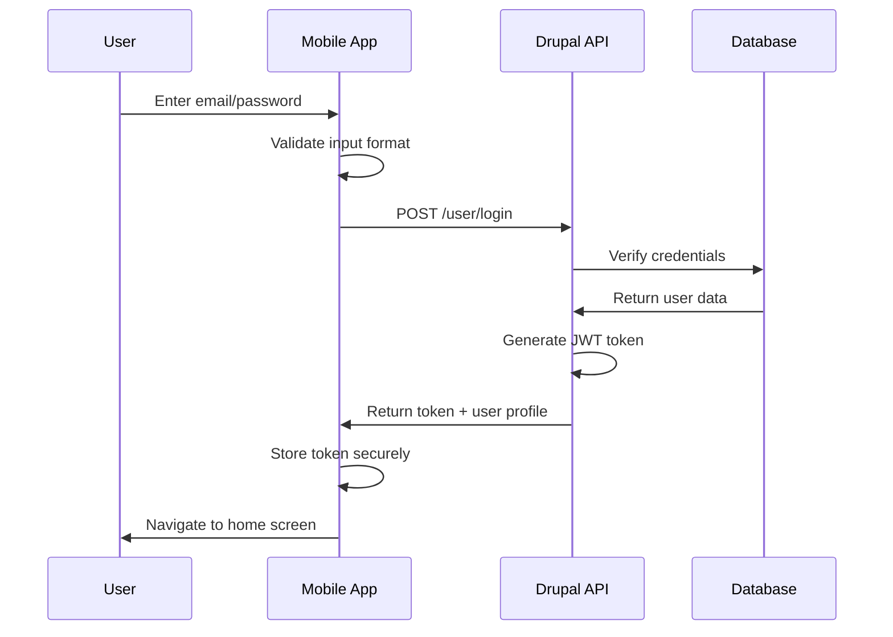

# AmISafe Mobile Application - User Registration & Authentication Guide

## 🔐 Authentication Architecture Overview

The AmISafe mobile application integrates with the existing Drupal-based user system on stlouisintegration.com, requiring users to register and authenticate before accessing crime safety features. This ensures user accountability, personalized safety preferences, and secure API access.

## 📋 User Registration Requirements

### **Mandatory Information**
- **Email Address**: Primary identifier and login credential
- **Password**: Strong password meeting security requirements
- **First Name**: For personalized notifications
- **Last Name**: For emergency contact purposes
- **Phone Number**: Optional for SMS emergency alerts
- **Emergency Contact**: Name and phone number of emergency contact

### **Security Requirements**
- **Password Strength**: Minimum 8 characters with uppercase, lowercase, number, and special character
- **Email Verification**: Email confirmation required before account activation
- **Terms of Service**: Acceptance of terms and privacy policy required
- **Age Verification**: Must be 18+ or have parental consent

### **Privacy Considerations**
- **Location Consent**: Explicit consent for location tracking
- **Data Sharing**: Optional consent for anonymized data sharing
- **Notification Preferences**: Granular control over alert types
- **Emergency Access**: Permission for emergency services to access location data

## 🚀 Registration Process Flow

### **Step 1: Initial Registration Screen**
```typescript
interface RegistrationData {
  email: string;
  password: string;
  confirmPassword: string;
  firstName: string;
  lastName: string;
  phoneNumber?: string;
  emergencyContact: {
    name: string;
    phone: string;
    relationship: string;
  };
  agreeToTerms: boolean;
  agreeToPrivacy: boolean;
  allowLocationTracking: boolean;
}
```

### **Step 2: Account Creation API Call**
```
POST https://stlouisintegration.com/user/register
Content-Type: application/json

{
  "mail": "user@example.com",
  "name": "user@example.com",
  "pass": "SecurePassword123!",
  "field_first_name": "John",
  "field_last_name": "Doe",
  "field_phone_number": "+1234567890",
  "field_emergency_contact": {
    "name": "Jane Doe",
    "phone": "+1234567891",
    "relationship": "Spouse"
  },
  "field_privacy_consent": true,
  "field_location_consent": true
}
```

### **Step 3: Email Verification Process**
1. **Account Created**: User receives confirmation of account creation
2. **Verification Email**: Automated email sent with verification link
3. **Email Confirmation**: User clicks verification link to activate account
4. **Account Activated**: User can now log in to the mobile application

### **Step 4: Mobile App Setup**
1. **Login with Credentials**: User enters email and password in mobile app
2. **JWT Token Received**: Server returns authentication token
3. **Profile Setup**: Additional mobile-specific preferences
4. **Location Permissions**: Request device location access
5. **Notification Setup**: Configure push notification preferences

## 🔑 Authentication Process Flow

### **Login Sequence**


### **Token Management**
```typescript
interface AuthToken {
  access_token: string;
  refresh_token: string;
  expires_in: number;
  token_type: "Bearer";
  user: {
    uid: number;
    mail: string;
    name: string;
    roles: string[];
    field_first_name: string;
    field_last_name: string;
  };
}
```

### **Authentication States**
1. **Unauthenticated**: No valid token, show login screen
2. **Authenticated**: Valid token, full app access
3. **Token Expired**: Token expired, attempt refresh
4. **Refresh Failed**: Redirect to login screen
5. **Offline Mode**: Limited functionality with cached credentials

## 🛡️ Security Implementation

### **Password Security**
- **Hashing**: Drupal's built-in password hashing (bcrypt)
- **Complexity Requirements**: Enforced both client and server-side
- **Breach Protection**: Integration with HaveIBeenPwned API for password checking
- **Password Reset**: Secure reset via email verification

### **Token Security**
```typescript
class AuthService {
  // Secure token storage
  private async storeToken(token: AuthToken): Promise<void> {
    await SecureStore.setItemAsync('auth_token', JSON.stringify(token));
  }
  
  // Token validation
  private isTokenValid(token: AuthToken): boolean {
    const now = Math.floor(Date.now() / 1000);
    return token.expires_in > now;
  }
  
  // Automatic token refresh
  private async refreshToken(): Promise<AuthToken | null> {
    // Implementation for token refresh
  }
}
```

### **Device Security**
- **Biometric Authentication**: Optional fingerprint/Face ID for quick login
- **Device Registration**: Unique device identifiers for security
- **Session Management**: Automatic logout after extended inactivity
- **Multi-Device Support**: Users can access app from multiple devices

## 📱 Mobile-Specific Registration Features

### **Enhanced User Profile**
```typescript
interface MobileUserProfile extends UserProfile {
  // Location preferences
  locationSharing: {
    allowPreciseLocation: boolean;
    allowBackgroundTracking: boolean;
    shareWithEmergencyServices: boolean;
  };
  
  // Notification preferences
  notifications: {
    highRiskAlerts: boolean;
    mediumRiskAlerts: boolean;
    locationChangeAlerts: boolean;
    dailySafetyUpdates: boolean;
    emergencyAlerts: boolean;
  };
  
  // Safety preferences
  safety: {
    emergencyContacts: EmergencyContact[];
    safeZones: Location[];
    avoidAreas: Location[];
    alertRadius: number; // meters
  };
  
  // Privacy settings
  privacy: {
    anonymizeData: boolean;
    allowDataSharing: boolean;
    deleteLocationHistory: boolean;
    minimumDataRetention: boolean;
  };
}
```

### **Device Permissions Integration**
```typescript
class PermissionService {
  async requestLocationPermission(): Promise<boolean> {
    const permission = await Location.requestForegroundPermissionsAsync();
    if (permission.status === 'granted') {
      const backgroundPermission = await Location.requestBackgroundPermissionsAsync();
      return backgroundPermission.status === 'granted';
    }
    return false;
  }
  
  async requestNotificationPermission(): Promise<boolean> {
    const permission = await Notifications.requestPermissionsAsync();
    return permission.status === 'granted';
  }
}
```

## 🔄 User Account Management

### **Profile Updates**
- **Personal Information**: Update name, phone, emergency contacts
- **Password Changes**: Secure password update with current password verification
- **Privacy Settings**: Modify data sharing and location preferences
- **Notification Settings**: Granular control over alert types and frequency

### **Account Security Features**
- **Login History**: View recent login attempts and locations
- **Active Sessions**: Manage devices with active app sessions
- **Security Alerts**: Notifications for suspicious account activity
- **Account Deletion**: Complete account and data deletion option

### **Data Export/Import**
- **Data Export**: Download all personal data (GDPR compliance)
- **Settings Backup**: Cloud backup of preferences and settings
- **Account Migration**: Transfer account to new device
- **Legacy Data**: Handle data from previous safety apps

## 🚨 Emergency Account Features

### **Emergency Bypass**
```typescript
interface EmergencyAccess {
  // Temporary access without full authentication
  emergencyMode: boolean;
  limitedFeatures: string[];
  emergencyContacts: EmergencyContact[];
  lastKnownLocation: Location;
  riskLevel: RiskLevel;
}
```

### **Emergency Authentication**
- **Emergency Mode**: Limited app access without login for emergencies
- **Quick Dial**: Direct access to emergency services (911)
- **Location Sharing**: Automatic location sharing with emergency contacts
- **Medical Information**: Access to critical medical information

### **Account Recovery**
- **Email Recovery**: Standard password reset via email
- **Phone Recovery**: SMS verification for account recovery
- **Emergency Contact Recovery**: Verification through registered emergency contacts
- **Admin Recovery**: Manual review for complex recovery situations

## 📊 User Analytics & Insights

### **Personal Safety Metrics**
- **Risk Exposure History**: Track time spent in different risk levels
- **Safe Route Analytics**: Most used safe routes and patterns
- **Response Times**: How quickly user responds to safety alerts
- **Location Patterns**: Understanding of regular locations and routes

### **Community Integration**
- **Safety Score**: Personal safety score based on behavior and choices
- **Community Contributions**: User reports and safety contributions
- **Achievement System**: Gamification of safety behaviors
- **Social Features**: Optional sharing with trusted contacts

## 🔐 Privacy & Compliance

### **Data Protection**
- **GDPR Compliance**: Full compliance with European data protection regulations
- **CCPA Compliance**: California Consumer Privacy Act compliance
- **Local Laws**: Compliance with local privacy and data protection laws
- **Regular Audits**: Quarterly security and privacy audits

### **User Rights**
- **Right to Access**: Users can access all their stored data
- **Right to Rectification**: Users can correct inaccurate data
- **Right to Erasure**: Complete data deletion ("right to be forgotten")
- **Right to Portability**: Export data in machine-readable format
- **Right to Object**: Opt-out of data processing activities

This comprehensive registration and authentication system ensures that AmISafe mobile users have secure, privacy-respecting access to life-saving safety information while maintaining compliance with all relevant privacy regulations and best practices.