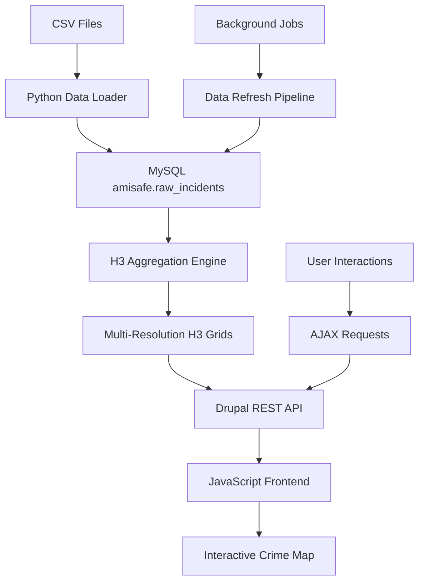

# amIsafe Philadelphia Crime Map Dashboard
## Architecture & Technical Specification

### Overview
The amIsafe Philadelphia Crime Map Dashboard is a web-based interactive visualization tool that displays crime data from Philadelphia using H3 hexagonal spatial indexing. It will be integrated as a submodule within the Theory of Conspiracies Drupal website, providing users with real-time crime analytics and spatial intelligence.

### System Architecture

#### Frontend Layer
- **Framework**: Drupal 11.2.5 module integration
- **JavaScript Libraries**:
  - Leaflet.js for interactive mapping
  - H3-js for client-side hexagon rendering
  - Chart.js for temporal analytics
  - D3.js for custom data visualizations
- **CSS Framework**: Bootstrap 5 with custom Crime Map theme
- **Module Structure**: Custom Drupal module (`amisafe`) with subpage routing

#### Backend Layer
- **Database**: MySQL 8.0 with `amisafe` database
- **Data Processing**: H3 Geolocation Framework (Python 3.12)
- **API Layer**: Drupal REST endpoints + custom controllers
- **Caching**: Redis for spatial query optimization
- **Real-time Updates**: Batch processing pipeline for data refresh

#### Data Architecture
```
MySQL Database: amisafe
├── raw_incidents (2.5M+ records)
├── h3_aggregated (multi-resolution summaries)
├── crime_categories (UCR code mappings)
├── district_boundaries (police districts)
└── temporal_aggregates (hourly/daily/monthly)
```

### Data Flow Architecture



### Dataset Definitions

#### Primary Data Schema
```sql
-- Raw incident data (109,553+ records loaded, 2.5M+ total)
raw_incidents:
├── id (BIGINT) - Primary key
├── source_file (VARCHAR) - Origin CSV file
├── cartodb_id (VARCHAR) - External reference
├── objectid (VARCHAR) - Incident identifier
├── dc_dist (VARCHAR) - Police district
├── psa (VARCHAR) - Police service area
├── dispatch_date_time (DATETIME) - Incident timestamp
├── dispatch_date (DATE) - Incident date
├── dispatch_time (TIME) - Incident time
├── hour (TINYINT) - Hour of day (0-23)
├── dc_key (VARCHAR) - Dispatch key
├── location_block (TEXT) - Address block
├── ucr_general (VARCHAR) - Crime category code
├── text_general_code (VARCHAR) - Crime description
├── point_x (DOUBLE) - Longitude
├── point_y (DOUBLE) - Latitude
├── lat (DECIMAL) - Normalized latitude
├── lng (DECIMAL) - Normalized longitude
├── h3_index (VARCHAR) - H3 hexagon identifier
├── h3_resolution (TINYINT) - H3 zoom level
├── properties (JSON) - Additional attributes
└── created_at (TIMESTAMP) - Record creation time
```

#### Aggregated Data Schema
```sql
-- Multi-resolution H3 aggregations
h3_aggregated:
├── h3_index (VARCHAR) - H3 cell identifier
├── resolution (TINYINT) - H3 zoom level (6-12)
├── crime_type (VARCHAR) - UCR category
├── total_incidents (INT) - Count of incidents
├── severity_score (DECIMAL) - Weighted severity
├── time_period (VARCHAR) - Temporal grouping
├── last_incident (DATETIME) - Most recent incident
├── avg_incidents_per_day (DECIMAL) - Daily average
├── trend_direction (ENUM) - Increasing/Decreasing/Stable
└── updated_at (TIMESTAMP) - Last aggregation time
```

#### Crime Category Mapping
```sql
-- UCR code definitions
crime_categories:
├── ucr_code (VARCHAR) - Primary key
├── category_name (VARCHAR) - Human readable name
├── severity_level (TINYINT) - 1-5 severity scale
├── color_hex (VARCHAR) - Map visualization color
├── icon_class (VARCHAR) - Font Awesome icon
├── description (TEXT) - Category description
└── parent_category (VARCHAR) - Hierarchical grouping
```

### Technology Stack

#### Core Technologies
1. **Drupal 11.2.5**
   - Custom module: `amisafe`
   - Theme integration: Theory of Conspiracies theme
   - User permissions and role management
   - Content management and configuration

2. **H3 Hexagonal Indexing**
   - Library: Uber H3 (v4.3.1)
   - Resolutions: 6-12 (district to block level)
   - Python backend + JavaScript frontend
   - Spatial aggregation and clustering

3. **MySQL 8.0 Database**
   - Primary storage: `amisafe` database
   - Spatial indexing on H3 cells
   - Optimized for geospatial queries
   - JSON support for flexible schemas

4. **Interactive Mapping**
   - **Leaflet.js**: Base mapping framework
   - **H3-js**: Client-side hexagon rendering
   - **Leaflet.heat**: Heatmap visualizations
   - **Custom plugins**: H3 layer management

#### Visualization Libraries
1. **Chart.js**
   - Temporal crime trends
   - Category breakdowns
   - Comparative analytics

2. **D3.js**
   - Custom hexagon visualizations
   - Interactive data exploration
   - Dynamic filtering interfaces

3. **Bootstrap 5**
   - Responsive grid system
   - UI components and modals
   - Mobile-first design

### Dashboard Features

#### Core Mapping Features
1. **Interactive H3 Crime Map**
   - Multi-resolution hexagon display (zoom levels 6-12)
   - Color-coded crime density visualization
   - Real-time data filtering and aggregation
   - Click interactions for detailed information

2. **Temporal Controls**
   - Date range selection (hourly, daily, weekly, monthly)
   - Time-of-day analysis (24-hour heatmap)
   - Seasonal trend visualization
   - Year-over-year comparisons

3. **Crime Category Filtering**
   - UCR code-based categorization
   - Severity-based filtering
   - Multiple selection support
   - Dynamic legend updates

4. **Geographic Controls**
   - Police district boundaries
   - Neighborhood overlays
   - Custom area selection
   - Address/intersection search

#### Advanced Analytics
1. **Spatial Analytics**
   - Crime density hotspots
   - Spatial clustering analysis
   - Distance-based correlations
   - Patrol route optimization

2. **Temporal Analytics**
   - Peak activity hours
   - Day-of-week patterns
   - Seasonal variations
   - Trend predictions

3. **Comparative Analytics**
   - District-to-district comparisons
   - Crime type correlations
   - Before/after incident analysis
   - Statistical significance testing

### User Interface Design

#### Layout Structure
```
┌─────────────────────────────────────────────────────┐
│ Theory of Conspiracies Header                       │
├─────────────────────────────────────────────────────┤
│ amIsafe Module Navigation                           │
├─────────────────────────────────────────────────────┤
│ ┌─────────────────┐ ┌─────────────────────────────┐ │
│ │   Filter Panel  │ │                             │ │
│ │                 │ │                             │ │
│ │ • Date Range    │ │        Interactive          │ │
│ │ • Crime Types   │ │        Crime Map            │ │
│ │ • Districts     │ │      (Leaflet + H3)         │ │
│ │ • Severity      │ │                             │ │
│ │ • Time of Day   │ │                             │ │
│ │                 │ │                             │ │
│ └─────────────────┘ └─────────────────────────────┘ │
├─────────────────────────────────────────────────────┤
│ ┌─────────────┐ ┌─────────────┐ ┌─────────────────┐ │
│ │Crime Trends │ │Time Pattern │ │  District Stats │ │
│ │(Chart.js)   │ │(D3 Heatmap) │ │  (Data Tables)  │ │
│ └─────────────┘ └─────────────┘ └─────────────────┘ │
└─────────────────────────────────────────────────────┘
```

#### Mobile Responsive Design
- Collapsible filter panel
- Touch-optimized map controls
- Swipeable chart interfaces
- Progressive disclosure of information

### API Architecture

#### REST Endpoints
```php
// Drupal REST endpoints
/api/amisafe/incidents
├── GET /incidents?filters[]=... - Filtered incident data
├── GET /incidents/{id} - Single incident details
├── GET /aggregated?resolution=8&period=daily - H3 aggregations
├── GET /categories - Crime category definitions
├── GET /districts - Police district boundaries
├── GET /hotspots?resolution=9 - Crime density hotspots
└── GET /trends?timeframe=30d - Temporal trend data
```

#### Data Response Formats
```json
{
  "incidents": [
    {
      "id": 123456,
      "h3_index": "892aacb2e57ffff",
      "lat": 39.9124426,
      "lng": -75.2427417,
      "crime_type": "600",
      "description": "Theft from Vehicle",
      "datetime": "2025-06-29T10:10:00Z",
      "district": "12",
      "block": "2500 BLOCK ISLAND AVE",
      "severity": 3
    }
  ],
  "meta": {
    "total": 109553,
    "filtered": 1247,
    "time_range": "2025-06-01 to 2025-06-30",
    "h3_resolution": 9
  }
}
```

### Performance Optimization

#### Database Optimization
1. **Spatial Indexing**
   - H3 index primary keys
   - Composite indexes on (h3_index, crime_type, date)
   - Geospatial indexes on lat/lng coordinates

2. **Query Optimization**
   - Pre-computed aggregations at multiple resolutions
   - Materialized views for common queries
   - Partitioning by date ranges

3. **Caching Strategy**
   - Redis cache for spatial queries
   - Browser caching for static H3 boundaries
   - CDN delivery for map tiles

#### Frontend Optimization
1. **Data Loading**
   - Progressive loading of map data
   - Viewport-based data fetching
   - WebGL acceleration for large datasets

2. **H3 Rendering**
   - Client-side H3 boundary generation
   - Level-of-detail based on zoom
   - Efficient polygon rendering

### Security Considerations

#### Data Privacy
- No personally identifiable information
- Aggregated location data only
- Incident-level data sanitized

#### Access Control
- Role-based permissions in Drupal
- API rate limiting
- Input validation and sanitization

#### Performance Security
- Query timeout limits
- Resource usage monitoring
- DDoS protection via caching

### Theory of Conspiracies Integration

#### Existing Module Structure
The AmISafe module already exists in the Theory of Conspiracies Drupal site:
```
sites/theoryofconspiracies/web/modules/custom/amisafe/
├── amisafe.info.yml - Module definition (Drupal 9/10/11 compatible)
├── amisafe.routing.yml - Route definitions (currently /amisafe dashboard)
├── amisafe.module - Hook implementations
├── amisafe.libraries.yml - CSS/JS library definitions
├── src/ - Controller and service classes
├── templates/ - Twig template files
├── css/ - Stylesheet assets
└── data/ - Static data files
```

#### Current Route Structure
- **Primary Route**: `/amisafe` - Main dashboard (existing)
- **New Route**: `/amisafe/crime-map` - Interactive crime map (to be added)
- **API Routes**: `/api/amisafe/*` - REST endpoints for data access

#### Enhanced Module Configuration

**amisafe.routing.yml** (Enhanced):
```yaml
# Existing dashboard route
amisafe.dashboard:
  path: '/amisafe'
  defaults:
    _controller: '\Drupal\amisafe\Controller\AmISafeController::dashboard'
    _title: 'Am I Safe?'
  requirements:
    _permission: 'access content'

# New crime map route
amisafe.crime_map:
  path: '/amisafe/crime-map'
  defaults:
    _controller: '\Drupal\amisafe\Controller\CrimeMapController::map'
    _title: 'Philadelphia Crime Map'
  requirements:
    _permission: 'access content'

# API routes for data access
amisafe.api.incidents:
  path: '/api/amisafe/incidents'
  defaults:
    _controller: '\Drupal\amisafe\Controller\ApiController::incidents'
    _format: 'json'
  requirements:
    _permission: 'access content'
    _method: 'GET'

amisafe.api.aggregated:
  path: '/api/amisafe/aggregated'
  defaults:
    _controller: '\Drupal\amisafe\Controller\ApiController::aggregated'
    _format: 'json'
  requirements:
    _permission: 'access content'
    _method: 'GET'

amisafe.api.hotspots:
  path: '/api/amisafe/hotspots'
  defaults:
    _controller: '\Drupal\amisafe\Controller\ApiController::hotspots'
    _format: 'json'
  requirements:
    _permission: 'access content'
    _method: 'GET'
```

**amisafe.libraries.yml** (Enhanced):
```yaml
# Core crime map library
crime-map:
  version: 1.x
  css:
    theme:
      css/crime-map.css: {}
      css/h3-hexagons.css: {}
  js:
    js/crime-map.js: {}
    js/h3-renderer.js: {}
    js/leaflet-integration.js: {}
  dependencies:
    - core/drupal
    - core/jquery
    - amisafe/leaflet
    - amisafe/h3-js

# External mapping libraries
leaflet:
  version: 1.9.4
  css:
    theme:
      https://unpkg.com/leaflet@1.9.4/dist/leaflet.css: { type: external }
  js:
    https://unpkg.com/leaflet@1.9.4/dist/leaflet.js: { type: external }

h3-js:
  version: 4.1.0
  js:
    https://unpkg.com/h3-js@4.1.0/dist/h3-js.umd.js: { type: external }

chart-js:
  version: 4.4.0
  js:
    https://cdn.jsdelivr.net/npm/chart.js@4.4.0/dist/chart.umd.js: { type: external }
```

#### Database Integration Strategy

**Connection Configuration**:
The module will use a dedicated database connection for the MySQL amisafe database:

```php
// settings.php addition for Theory of Conspiracies site
$databases['amisafe'] = [
  'default' => [
    'database' => 'amisafe',
    'username' => 'h3_user',
    'password' => 'secure_h3_password',
    'prefix' => '',
    'host' => 'localhost',
    'port' => '3306',
    'namespace' => 'Drupal\\mysql\\Driver\\Database\\mysql',
    'driver' => 'mysql',
  ],
];
```

#### Cyberpunk Theme Integration

The crime map will integrate seamlessly with the Theory of Conspiracies cyberpunk aesthetic:

**Visual Design Elements**:
- **Color Scheme**: Neon blues, electric greens, terminal amber
- **Typography**: Monospace fonts for data displays
- **UI Elements**: Glitch effects, scanlines, terminal-style interfaces
- **Map Styling**: Dark base tiles with neon overlays

**CSS Integration** (crime-map.css):
```css
/* Cyberpunk crime map styling */
.crime-map-container {
  background: linear-gradient(135deg, #0a0a0a 0%, #1a1a2e 100%);
  border: 2px solid #00ffff;
  box-shadow: 0 0 20px rgba(0, 255, 255, 0.3);
  position: relative;
}

.crime-map-container::before {
  content: '';
  position: absolute;
  top: 0;
  left: 0;
  right: 0;
  bottom: 0;
  background: repeating-linear-gradient(
    0deg,
    transparent,
    transparent 2px,
    rgba(0, 255, 255, 0.1) 2px,
    rgba(0, 255, 255, 0.1) 4px
  );
  pointer-events: none;
}

.h3-hexagon {
  fill-opacity: 0.7;
  stroke: #00ffff;
  stroke-width: 1px;
  transition: all 0.3s ease;
}

.h3-hexagon:hover {
  fill-opacity: 0.9;
  stroke-width: 2px;
  filter: drop-shadow(0 0 10px currentColor);
}

.crime-stats-panel {
  background: rgba(0, 0, 0, 0.8);
  border: 1px solid #00ff00;
  color: #00ff00;
  font-family: 'Courier New', monospace;
  padding: 15px;
  backdrop-filter: blur(5px);
}

.terminal-text {
  color: #00ff00;
  font-family: 'Courier New', monospace;
  text-shadow: 0 0 5px rgba(0, 255, 0, 0.5);
}
```

### Development Phases

#### Phase 1: Core Infrastructure Enhancement (Week 1-2)
- **Extend existing AmISafe module**:
  - Add CrimeMapController and ApiController classes
  - Implement database service for amisafe MySQL connection
  - Create H3 aggregation service
  - Add new routes for crime map and API endpoints

- **Database Integration**:
  - Configure secondary database connection
  - Implement data access layer with proper caching
  - Create aggregation services for real-time queries

#### Phase 2: Interactive Map Implementation (Week 3-4)
- **Frontend Development**:
  - Implement Leaflet.js with cyberpunk styling
  - Create H3 hexagon rendering system
  - Build filtering interface with Theory of Conspiracies theme
  - Integrate crime category mapping with visual indicators

- **API Development**:
  - REST endpoints for incident data
  - H3 aggregation endpoints
  - Hotspot analysis API
  - Real-time data refresh mechanisms

#### Phase 3: Advanced Analytics & Visualization (Week 5-6)
- **Temporal Analytics**:
  - Time-series crime trend analysis
  - Peak activity visualization
  - Seasonal pattern recognition
  - Predictive modeling interfaces

- **Statistical Visualizations**:
  - Chart.js integration with cyberpunk styling
  - D3.js custom visualizations
  - Interactive data exploration tools
  - District comparison dashboards

#### Phase 4: Integration & Polish (Week 7-8)
- **Theme Integration**:
  - Complete cyberpunk visual styling
  - Mobile responsive design
  - Animation and transition effects
  - User experience optimization

- **Performance & Security**:
  - Query optimization and caching
  - API rate limiting implementation
  - Security hardening
  - Load testing and optimization

### File Structure
```
h3-geolocation/
├── amisafe-dashboard/
│   ├── ARCHITECTURE.md (this file)
│   ├── API_SPECIFICATION.md
│   ├── DATABASE_SCHEMA.md
│   ├── FRONTEND_SPECIFICATION.md
│   ├── DEPLOYMENT_GUIDE.md
│   └── USER_STORIES.md
└── drupal-integration/
    ├── modules/amisafe/
    ├── themes/crime-map/
    └── config/
```

This architecture provides a solid foundation for building a comprehensive crime mapping dashboard that rivals professional law enforcement tools while maintaining open-source principles and community accessibility.